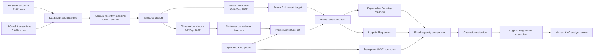
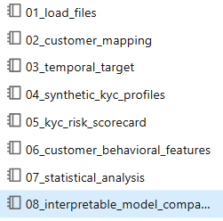
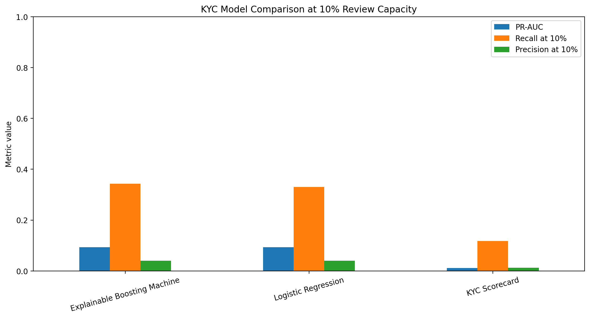
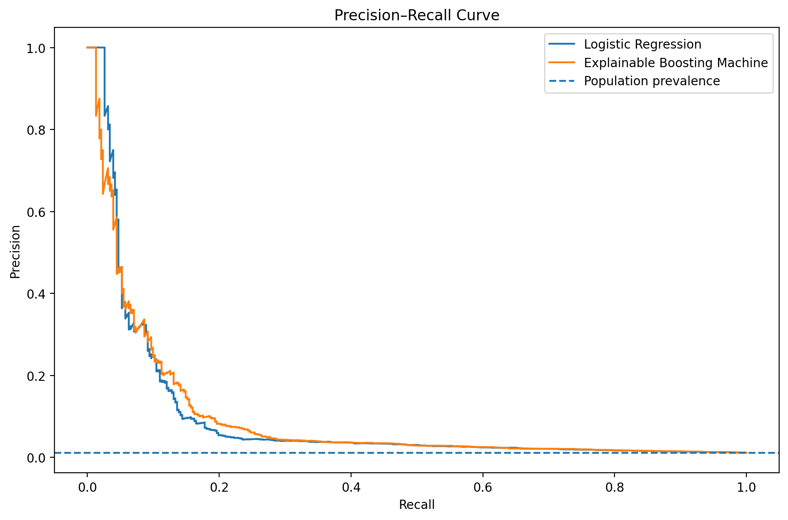
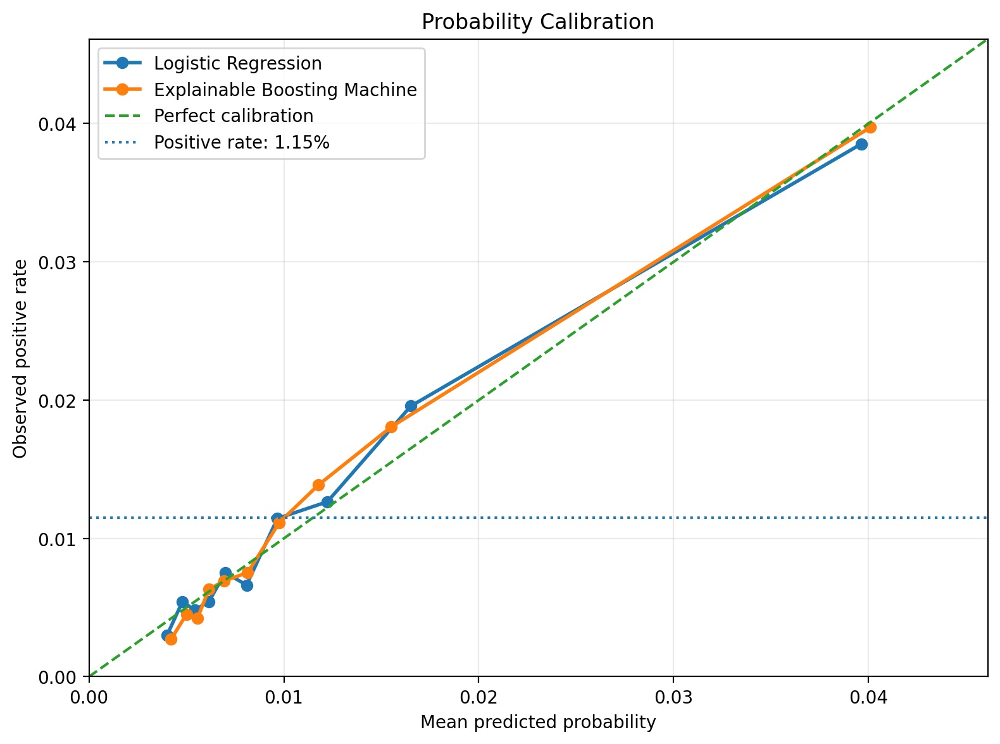
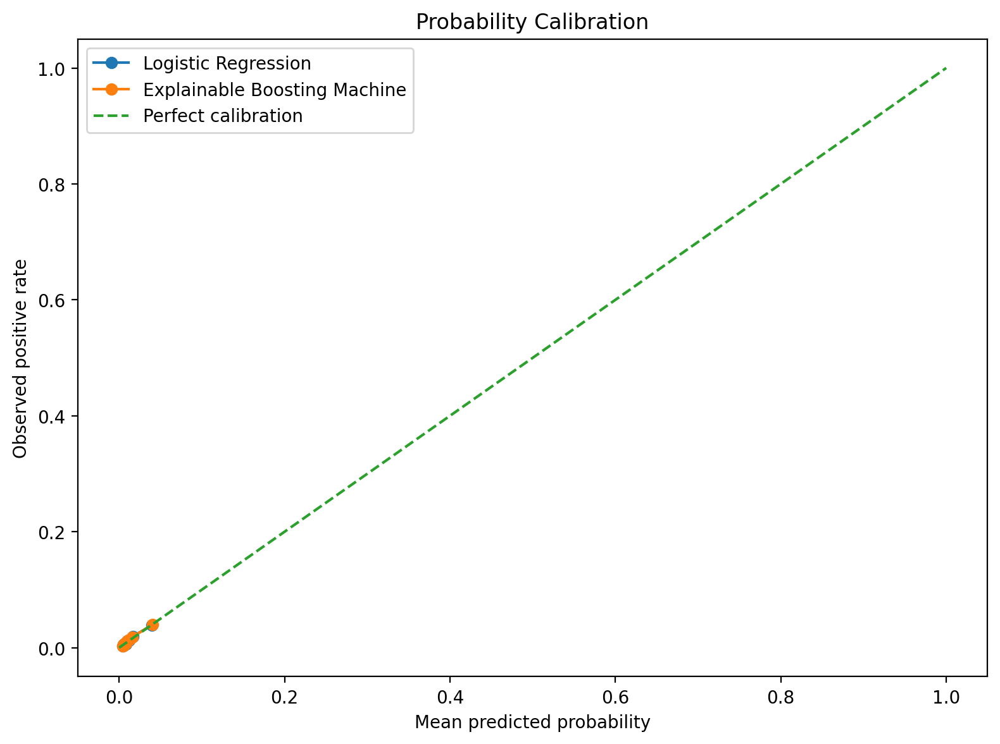
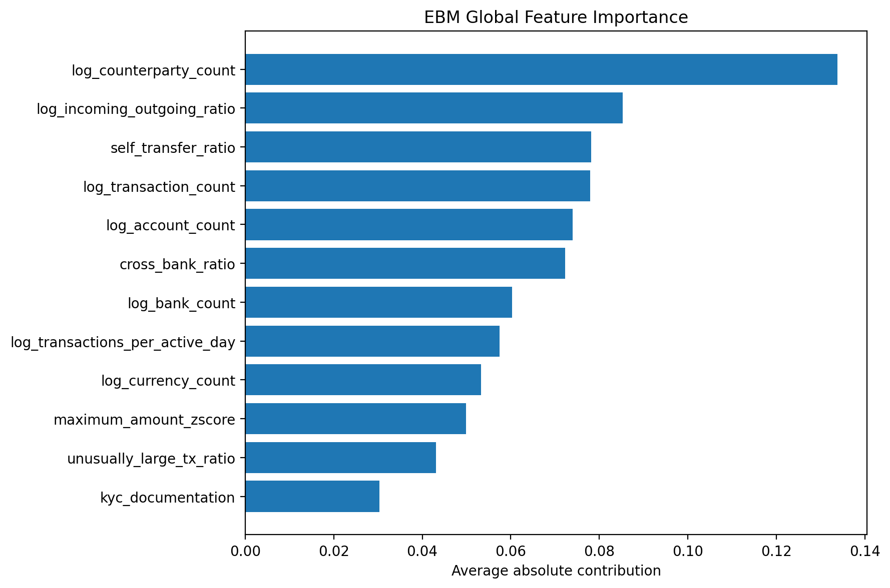
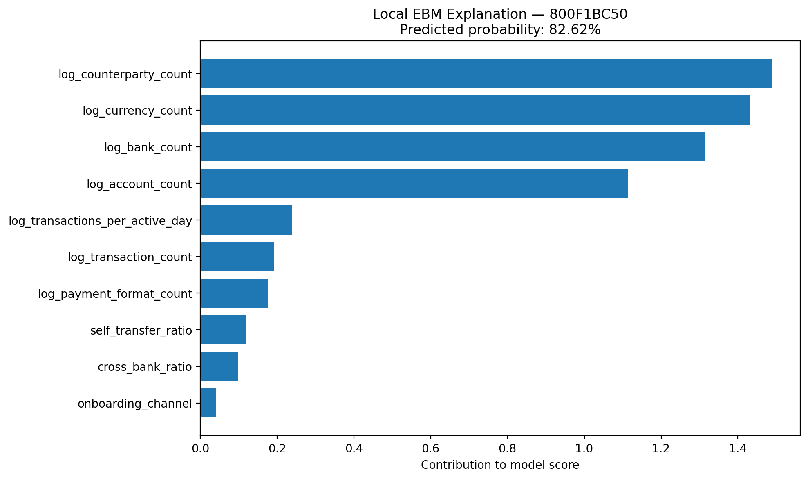
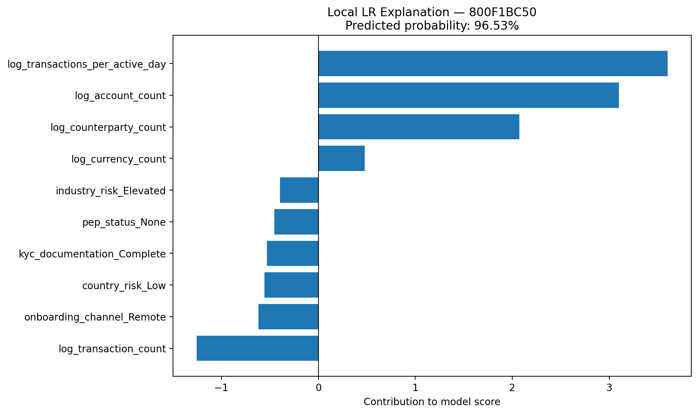
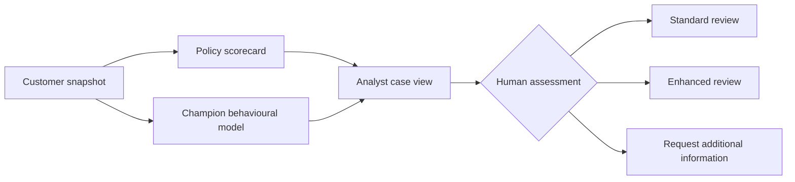

# Explainable KYC Risk Modelling

## Periodic Review Prioritisation with a Transparent Scorecard, Logistic Regression, and an Explainable Boosting Machine

<p align="center">
  <strong>A compact, bank-focused modelling project that separates policy-based KYC risk assessment from predictive behavioural review prioritisation.</strong>
</p>

<p align="center">
  
  
  
  
  
  
</p>

---

## Project summary

Banks must periodically reassess customers, but analyst capacity is limited. This project asks a practical question:

> **Which existing customers should be prioritised for enhanced KYC review, and what evidence supports that prioritisation?**

The project develops and compares three approaches:

1. A **transparent KYC scorecard** based on static policy-style risk factors.
2. A **Logistic Regression model** as the simple, directly interpretable predictive baseline.
3. An **Explainable Boosting Machine (EBM)** as a nonlinear but intrinsically interpretable challenger.

The final model is selected using a predeclared balance of **predictive performance, calibration, operational value, explainability, and governance complexity**. The selected champion is **Logistic Regression**. EBM achieved a small performance improvement, but the uplift was not material enough to justify the additional validation and maintenance burden.

> [!IMPORTANT]
> This is a **customer-review prioritisation prototype**. It does not determine whether a customer is involved in money laundering, automatically reject or exit a customer, file a suspicious activity report, or replace a qualified KYC/financial-crime analyst.

---

## At a glance

| Item | Result |
|---|---:|
| Transaction records audited | **5,078,345** |
| Account records | **518,581** |
| Customer/entity modelling population | **166,083** |
| Future-positive customers | **1,909** |
| Customer-level positive rate | **1.1494%** |
| Observation window | **1–7 September 2022** |
| Outcome window | **8–10 September 2022** |
| Operational review capacity | **Approximately 10%** |
| Champion model | **Logistic Regression** |
| Champion Recall at capacity | **32.98%** |
| Champion Precision at capacity | **3.97%** |
| Champion lift at capacity | **3.45×** |
| Challenger | **Explainable Boosting Machine** |

---

## Table of contents

- [Why this project](#why-this-project)
- [Business interpretation](#business-interpretation)
- [Architecture](#architecture)
- [Dataset](#dataset)
- [End-to-end methodology](#end-to-end-methodology)
- [1. Data audit and entity mapping](#1-data-audit-and-entity-mapping)
- [2. Temporal target design](#2-temporal-target-design)
- [3. Synthetic KYC profile](#3-synthetic-kyc-profile)
- [4. Transparent KYC scorecard](#4-transparent-kyc-scorecard)
- [5. Behavioural feature engineering](#5-behavioural-feature-engineering)
- [6. Statistical analysis](#6-statistical-analysis)
- [7. Interpretable model development](#7-interpretable-model-development)
- [8. Evaluation and model selection](#8-evaluation-and-model-selection)
- [Explainability](#explainability)
- [Notebook walkthrough](#notebook-walkthrough)
- [Reproduce the project](#reproduce-the-project)
- [Data and model governance](#data-and-model-governance)
- [Limitations](#limitations)
- [Future improvements](#future-improvements)
- [Key conclusions](#key-conclusions)
- [References](#references)

---

## Why this project

KYC risk modelling in a regulated bank is not only a question of finding the model with the highest score. A useful solution must also be:

- technically reproducible;
- understandable to risk specialists and analysts;
- stable enough to monitor;
- suitable for validation;
- proportionate to the business benefit;
- explicit about its assumptions and limitations;
- designed with human review as a control.

This repository therefore focuses on the **modelling and governance problem**, rather than building another large infrastructure demonstration. The scope is intentionally compact: one customer-level dataset, one transparent policy baseline, two interpretable predictive models, fixed-capacity evaluation, statistical analysis, global and local explanations, and a documented champion–challenger decision.

> [!NOTE]
> The project deliberately avoids a complex black-box model. EBM was chosen instead of XGBoost because it can learn nonlinear feature effects while remaining an additive, glass-box model. Logistic Regression remains the strongest simplicity benchmark.

---

## Business interpretation

The project separates two concepts that are often confused.

### 1. Initial or inherent KYC risk

This is represented by the **transparent scorecard**. It uses customer attributes such as:

- PEP status;
- country-risk category;
- ownership complexity;
- industry risk;
- onboarding channel;
- documentation completeness.

These factors support a policy-style assessment of inherent customer risk. They are transparent, deterministic, and easy to document.

### 2. Behavioural periodic-review priority

This is represented by **Logistic Regression and EBM**. The predictive models use observed account and transaction behaviour, including:

- transaction frequency;
- number of counterparties;
- number of accounts and banks;
- transaction intensity;
- currency diversity;
- self-transfer activity;
- cross-bank activity;
- unusually large transactions relative to the same currency.

The output is a **future behavioural risk signal used to rank customers for review**.

> [!IMPORTANT]
> A policy factor can remain important for KYC even when it is not predictive of a particular synthetic outcome. Regulatory or policy relevance and statistical prediction are not the same concept.

---

## Architecture



The scorecard is evaluated as a separate ranking baseline. It is **not fed into the predictive models**, which prevents the model comparison from simply reproducing the policy score.

---

## Dataset

The project uses the **HI-Small** files from the IBM synthetic AML dataset:

```text
/Volumes/main/default/aml_dataset/
├── HI-Small_Trans.csv
├── HI-Small_accounts.csv
└── HI-Small_Patterns.txt
```

The full Databricks volume also contains the HI/LI small, medium, and large variants, but only `HI-Small` is required for this project.

### Files used

| File | Role in the project |
|---|---|
| `HI-Small_Trans.csv` | Transaction history and transaction-level `Is Laundering` label |
| `HI-Small_accounts.csv` | Mapping from bank account to customer/entity |
| `HI-Small_Patterns.txt` | Human-readable laundering-pattern examples; retained for context, not used as a model feature |

### Original transaction schema

```text
Timestamp
From Bank
Account2
To Bank
Account4
Amount Received
Receiving Currency
Amount Paid
Payment Currency
Payment Format
Is Laundering
```

### Original account schema

```text
Bank Name
Bank ID
Account Number
Entity ID
Entity Name
```

> [!WARNING]
> The data are synthetic. Entity structures, account counts, bank relationships, transaction patterns, and labels reflect the simulation design and must not be interpreted as representative statistics for a real financial institution.

---

## End-to-end methodology

The implementation is divided into eight ordered Databricks notebooks:

<p align="center">
  
</p>

```text
01_load_files
02_customer_mapping
03_temporal_target
04_synthetic_kyc_profiles
05_kyc_risk_scorecard
06_customer_behavioral_features
07_statistical_analysis
08_interpretable_model_comparison
```

Each notebook has one clear responsibility and creates reusable Delta tables for the next stage.

---

# 1. Data audit and entity mapping

## Data audit

The first notebook validates:

- file availability;
- row counts;
- schemas;
- null values;
- timestamp range;
- label balance;
- sample pattern records.

### Audit results

| Measure | Result |
|---|---:|
| Transactions | **5,078,345** |
| Accounts | **518,581** |
| Transaction columns | **11** |
| Account columns | **5** |
| Transaction-level laundering labels | **5,177** |
| Transaction-level positive rate | **0.1019%** |
| Minimum timestamp | **2022-09-01 00:00** |
| Maximum timestamp | **2022-09-18 16:18** |

The transaction-level target is extremely imbalanced. Accuracy would therefore be misleading: a model that predicts every transaction as negative would still appear highly accurate.

## Account-to-customer mapping

The modelling unit is the **customer/entity**, not an individual transaction or account.

A transaction is enriched with:

```text
sender_entity_id
sender_entity_name
receiver_entity_id
receiver_entity_name
```

The join uses the compound keys:

```text
From Bank + Account2  -> sender entity
To Bank   + Account4  -> receiver entity
```

Bank IDs and account numbers are normalised before joining to avoid differences caused by leading zeros or formatting.

### Mapping results

| Measure | Result |
|---|---:|
| Transactions mapped | **5,078,345** |
| Unmatched senders | **0** |
| Unmatched receivers | **0** |
| Sender mapping coverage | **100%** |
| Receiver mapping coverage | **100%** |
| Distinct sender entities | **160,369** |
| Distinct receiver entities | **165,281** |

> [!NOTE]
> Some synthetic entities hold very large numbers of accounts across many banks. This is a useful risk signal to examine, but it is not sufficient evidence of suspicious behaviour by itself. The project tests account and bank counts together with future labelled behaviour rather than treating scale as proof.

### Main outputs

```text
main.default.kyc_customer_accounts
main.default.kyc_enriched_transactions
```

---

# 2. Temporal target design

## Why a temporal target is necessary

The model should use historical information to predict a later event. Using outcome-period information as a feature would create target leakage and produce an unrealistically strong model.

The original data have a significant volume anomaly after 10 September:

| Date range | Behaviour |
|---|---|
| 1–10 September | Hundreds of thousands of transactions per day |
| 11–18 September | Volume collapses to hundreds or fewer records per day |
| 11–18 September | Label rate jumps to approximately 58–73% |

The late tail is therefore excluded from model development.

> [!IMPORTANT]
> The exclusion is not based on whether the model performs better. It is a data-quality decision made because the population-generating process changes abruptly and the tail no longer resembles the preceding transaction stream.

## Final windows

```text
Observation window:  2022-09-01 to 2022-09-07
Outcome window:      2022-09-08 to 2022-09-10
Excluded tail:       2022-09-11 to 2022-09-18
```

## Customer-level target

A customer receives:

```text
future_aml_event = 1
```

when the entity appears as either sender or receiver in at least one laundering-labelled transaction during the outcome window.

Conceptually:

```text
future_aml_event(entity) =
    1, if the entity participates in an outcome-window labelled transaction
    0, otherwise
```

### Target distribution

| Target | Customers | Percentage |
|---|---:|---:|
| `0` | 164,174 | 98.8506% |
| `1` | 1,909 | 1.1494% |
| **Total** | **166,083** | **100%** |

The customer-level target is still imbalanced, but it is more workable than the original transaction-level rate.

> [!WARNING]
> `future_aml_event = 1` is a modelling label and review-priority signal. It is not proof that the entity intentionally committed money laundering. A receiver may be associated with a labelled transaction without having the same role as the sender.

### Main outputs

```text
main.default.kyc_observation_transactions
main.default.kyc_customer_target
```

---

# 3. Synthetic KYC profile

The IBM transaction data do not provide a complete KYC customer profile. To demonstrate KYC policy design without using real personal data, reproducible synthetic attributes are created for every entity.

## Generated attributes

| Attribute | Values | Intended distribution |
|---|---|---:|
| Customer type | Corporation, Partnership, Sole Proprietorship, Other | Derived from entity name |
| Country risk | Low, Medium, High | 75%, 20%, 5% |
| PEP status | None, Associate, Direct | 97%, 2%, 1% |
| UBO complexity | Simple, Moderate, Complex | 70%, 22%, 8% |
| Industry risk | Standard, Elevated, Cash Intensive | 65%, 25%, 10% |
| Onboarding channel | Branch, Remote | 70%, 30% |
| KYC documentation | Complete, Incomplete | 92%, 8% |

The attributes are generated with deterministic hashes of `entity_id`. This provides two benefits:

- the same entity receives the same profile on every run;
- the values are created independently of the future target.

### Observed synthetic distributions

| Variable | Distribution |
|---|---|
| Customer type | Corporation 33.39%, Sole Proprietorship 33.33%, Partnership 33.20%, Other 0.08% |
| Country risk | Low 75.07%, Medium 19.96%, High 4.97% |
| PEP status | None 97.06%, Associate 1.97%, Direct 0.97% |
| UBO complexity | Simple 69.90%, Moderate 21.99%, Complex 8.10% |
| Industry risk | Standard 64.95%, Elevated 25.06%, Cash Intensive 9.99% |
| Onboarding channel | Branch 70.06%, Remote 29.94% |
| Documentation | Complete 91.96%, Incomplete 8.04% |

> [!NOTE]
> Independence from the target is intentional. The project must not secretly assign “high-risk” KYC attributes to known positive cases, because that would encode the answer into the input and invalidate the comparison.

### Main output

```text
main.default.kyc_customer_profiles
```

---

# 4. Transparent KYC scorecard

The scorecard represents a simple, policy-style initial KYC risk assessment.

## Scorecard rules

| Risk factor | Condition | Points |
|---|---|---:|
| Country risk | Medium | 8 |
| Country risk | High | 20 |
| PEP status | Associate | 15 |
| PEP status | Direct | 25 |
| UBO complexity | Moderate | 8 |
| UBO complexity | Complex | 20 |
| Industry risk | Elevated | 7 |
| Industry risk | Cash Intensive | 15 |
| Onboarding channel | Remote | 5 |
| Documentation | Incomplete | 15 |

Maximum possible score:

```text
20 + 25 + 20 + 15 + 5 + 15 = 100
```

## Risk-rating thresholds

| Score | Rating |
|---:|---|
| 0–14 | LOW |
| 15–34 | MEDIUM |
| 35–100 | HIGH |

## Reason codes

The implementation produces deterministic analyst-facing reasons such as:

```text
HIGH_RISK_COUNTRY
DIRECT_PEP
PEP_ASSOCIATE
COMPLEX_UBO_STRUCTURE
CASH_INTENSIVE_INDUSTRY
REMOTE_ONBOARDING
INCOMPLETE_KYC_DOCUMENTATION
```

Example output:

```json
{
  "entity_id": "EXAMPLE_ENTITY",
  "kyc_risk_score": 40,
  "kyc_risk_rating": "HIGH",
  "reason_codes": [
    "HIGH_RISK_COUNTRY",
    "MODERATE_UBO_COMPLEXITY",
    "REMOTE_ONBOARDING"
  ]
}
```

## Scorecard population

| Rating | Customers | Average score | Population share |
|---|---:|---:|---:|
| LOW | 99,386 | 5.22 | 59.84% |
| MEDIUM | 58,676 | 20.95 | 35.33% |
| HIGH | 8,021 | 40.15 | 4.83% |

## Scorecard versus future outcome

| Rating | Customers | Future-positive customers | Future-positive rate |
|---|---:|---:|---:|
| LOW | 99,386 | 1,171 | 1.1782% |
| MEDIUM | 58,676 | 653 | 1.1129% |
| HIGH | 8,021 | 85 | 1.0597% |

The scorecard does not separate the synthetic future outcome. This is expected because the KYC attributes were generated independently of the label.

This is an important modelling lesson:

> **A transparent scorecard can be a valid policy mechanism without being a strong predictor of a separately generated behavioural label.**

The project therefore retains the scorecard as a transparent baseline rather than adjusting its weights to fit the target after observing the results.

> [!WARNING]
> Changing the scorecard weights until the synthetic future label improves would turn a policy demonstration into an overfit predictive model and destroy the intended separation between rules and observed behaviour.

### Main output

```text
main.default.kyc_customer_scorecard
```

---

# 5. Behavioural feature engineering

All predictive features are calculated from the observation window only.

## Directional event model

Each transaction is represented twice:

- once from the sender’s perspective as an outgoing event;
- once from the receiver’s perspective as an incoming event.

This allows one consistent entity-level aggregation while preserving direction.

## Currency-aware amount standardisation

Amounts in dollars, euros, yuan, and other currencies cannot be added or compared directly without conversion rates. Instead, the project:

1. applies `log(amount + 1)`;
2. calculates the mean and standard deviation within each currency;
3. expresses each amount as a within-currency z-score.

This produces:

```text
average_amount_zscore
maximum_amount_zscore
unusually_large_tx_count
unusually_large_tx_ratio
```

An unusually large transaction is defined as:

```text
amount_zscore >= 2.5
```

> [!NOTE]
> This is a relative amount indicator, not a currency conversion. It asks whether a transaction is unusually large compared with other transactions in the same currency.

## Aggregated behavioural features

| Feature | Meaning |
|---|---|
| `transaction_count` | Distinct transactions involving the entity |
| `outgoing_tx_count` | Distinct outgoing transactions |
| `incoming_tx_count` | Distinct incoming transactions |
| `active_days` | Number of active observation days |
| `transactions_per_active_day` | Transaction intensity |
| `counterparty_count` | Distinct non-self counterparties |
| `counterparty_bank_count` | Distinct counterparty banks |
| `currency_count` | Number of currencies used |
| `payment_format_count` | Number of payment formats used |
| `maximum_amount_zscore` | Largest relative amount |
| `unusually_large_tx_ratio` | Share of unusually large transactions |
| `cross_bank_ratio` | Share of transactions involving another bank |
| `self_transfer_ratio` | Share of transactions between the same entity |
| `incoming_outgoing_ratio` | Balance between incoming and outgoing activity |
| `account_count` | Number of accounts mapped to the entity |
| `bank_count` | Number of banks holding those accounts |

> [!IMPORTANT]
> `cross_bank_ratio` means activity across different bank IDs. It is **not** a true cross-border ratio. No geographic inference is made from this field.

## Behavioural differences

### Group means

| Measure | Future-negative | Future-positive |
|---|---:|---:|
| Average transaction count | 35.59 | 528.42 |
| Average counterparties | 5.67 | 58.28 |
| Average transactions per active day | 5.62 | 75.94 |
| Average maximum amount z-score | 1.762 | 2.130 |
| Average cross-bank ratio | 0.8601 | 0.8333 |
| Average self-transfer ratio | 0.1253 | 0.1497 |
| Average account count | 2.56 | 51.65 |
| Average bank count | 2.48 | 18.51 |

The means reveal strong differences but are influenced by extreme synthetic entities. Medians and effect sizes are therefore examined before modelling.

### Main output

```text
main.default.kyc_customer_features
```

---

# 6. Statistical analysis

The project uses statistical tests as diagnostic evidence, not as an automatic feature-selection rule.

## Numeric features

Because count and ratio variables are skewed, the analysis uses:

- **Mann–Whitney U test** for distributional differences;
- **rank-biserial correlation** as an effect-size measure;
- **Bonferroni-adjusted p-values** for multiple comparisons.

Approximate interpretation used in the project:

| Absolute effect | Interpretation |
|---:|---|
| < 0.10 | Negligible |
| 0.10–0.30 | Small |
| 0.30–0.50 | Moderate |
| > 0.50 | Strong |

### Leading numeric results

| Feature | Positive median | Negative median | Rank-biserial effect | Interpretation |
|---|---:|---:|---:|---|
| `counterparty_count` | 7 | 4 | 0.361 | Moderate |
| `account_count` | 4 | 1 | 0.359 | Moderate |
| `bank_count` | 4 | 1 | 0.358 | Moderate |
| `transactions_per_active_day` | 6.50 | 4.43 | 0.294 | Small-to-moderate |
| `transaction_count` | 43 | 27 | 0.284 | Small-to-moderate |
| `currency_count` | 1 | 1 | 0.222 | Small |
| `payment_format_count` | 5 | 4 | 0.209 | Small |
| `maximum_amount_zscore` | 2.063 | 1.746 | 0.206 | Small |
| `cross_bank_ratio` | 0.886 | 0.926 | -0.187 | Small, lower for positives |
| `incoming_outgoing_ratio` | 1.061 | 1.500 | -0.185 | Small, lower for positives |
| `self_transfer_ratio` | 0.100 | 0.067 | 0.176 | Small |
| `unusually_large_tx_ratio` | 0 | 0 | 0.127 | Small |

All adjusted p-values are extremely small. Because the dataset is large, the project gives more weight to **effect magnitude and business meaning** than to significance alone.

> [!IMPORTANT]
> A tiny p-value does not imply a large or operationally valuable effect. With more than 166,000 customers, even small distributional differences can be statistically significant.

## Categorical features

Categorical associations are tested with:

- **Chi-square test**;
- **Cramér’s V** effect size.

### Results

| Feature | Cramér’s V |
|---|---:|
| Customer type | 0.0088 |
| Industry risk | 0.0046 |
| PEP status | 0.0037 |
| KYC risk rating | 0.0035 |
| UBO complexity | 0.0027 |
| Onboarding channel | 0.0018 |
| Documentation status | 0.0008 |
| Country risk | 0.0006 |

These effects are negligible, confirming that the synthetic KYC attributes are effectively independent of the future outcome.

### Main outputs

```text
main.default.kyc_numeric_statistical_tests
main.default.kyc_categorical_statistical_tests
```

---

# 7. Interpretable model development

## Final predictive feature set

### Numeric features

The highly skewed count features are transformed with `log1p`:

```text
log_transaction_count
log_counterparty_count
log_transactions_per_active_day
maximum_amount_zscore
cross_bank_ratio
self_transfer_ratio
unusually_large_tx_ratio
log_incoming_outgoing_ratio
log_account_count
log_bank_count
log_currency_count
log_payment_format_count
```

### Categorical features

```text
customer_type
country_risk
pep_status
ubo_complexity
industry_risk
onboarding_channel
kyc_documentation
```

The synthetic categorical features are retained because the project is designed to test whether policy-style KYC attributes add predictive information. Their weak effects are then documented rather than hidden.

## Data split

The customer snapshot is split reproducibly with stratification:

```text
Training:    60%
Validation:  20%
Test:        20%
Random seed: 42
```

The validation set is used to determine the fixed-capacity threshold. The test set is used only for final evaluation.

> [!NOTE]
> The feature and target windows are temporal, which prevents future information from entering the features. However, the train/validation/test split is across customers within one snapshot. It is not a complete out-of-time model validation across multiple calendar periods; this is documented as a limitation.

## Logistic Regression

The Logistic Regression pipeline uses:

- standard scaling for numeric features;
- one-hot encoding for categorical features;
- unweighted maximum-likelihood fitting;
- `lbfgs` solver;
- maximum 2,000 iterations.

Class weighting is not applied because the model is evaluated through ranking and fixed analyst capacity, while preserving more meaningful raw probability estimates.

### Why Logistic Regression is valuable

- coefficients have a direct direction and magnitude;
- numeric contributions can be traced after scaling;
- category effects are explicit;
- training and scoring are operationally simple;
- validation and monitoring burden is relatively low;
- probability calibration is naturally testable.

## Explainable Boosting Machine

The EBM challenger uses `InterpretML` with:

```text
interactions = 0
max_bins = 64
outer_bags = 4
validation_size = 0.15
learning_rate = 0.03
max_rounds = 2000
early_stopping_rounds = 50
min_samples_leaf = 20
```

With `interactions=0`, the model remains purely additive:

```text
model score =
    intercept
    + contribution(feature 1)
    + contribution(feature 2)
    + ...
```

This lets EBM learn nonlinear shapes for individual features without becoming a general black-box ensemble.

### Why EBM is an appropriate challenger

- it can capture nonlinear relationships missed by Logistic Regression;
- it remains globally and locally interpretable;
- each feature has a learned shape function;
- each prediction can be decomposed into additive contributions;
- it provides a practical test of whether nonlinear complexity adds material value.

---

# 8. Evaluation and model selection

## Why a fixed review capacity is used

In a real KYC operation, the main constraint is often analyst capacity. A default probability threshold of `0.50` is not meaningful when the positive rate is approximately 1.15%.

This project therefore asks:

> **How many future-positive customers can the bank capture when it can review approximately 10% of the population?**

The score threshold for each approach is selected on the validation set at the 90th percentile, then applied unchanged to the test set.

Because of tied scorecard values and differences between validation and test distributions, realised test review rates are close to—but not exactly—10%.

## Model comparison

<p align="center">
  
</p>

| Model | Validation-derived threshold | Test review rate | PR-AUC | ROC-AUC | Precision at capacity | Recall at capacity | Lift at capacity | Brier score |
|---|---:|---:|---:|---:|---:|---:|---:|---:|
| Explainable Boosting Machine | 1.921% | 9.742% | 9.361% | 72.408% | 4.048% | 34.293% | 3.520× | 0.010897 |
| **Logistic Regression** | **2.027%** | **9.552%** | **9.285%** | **71.627%** | **3.971%** | **32.984%** | **3.453×** | **0.010879** |
| KYC Scorecard | 28 points | 10.419% | 1.163% | 49.309% | 1.300% | 11.780% | 1.131× | Not applicable |

> [!NOTE]
> The scorecard evaluation threshold of **28 points** is a capacity threshold used for ranking comparison. It is separate from the policy-style HIGH-risk threshold of **35 points**. The scorecard is not a calibrated probability model, so a Brier score is not reported.

## Operational interpretation

The test set contains approximately **33,217 customers**, including **382 future-positive customers**.

| Model | Customers reviewed | Future-positive customers found |
|---|---:|---:|
| EBM | ~3,236 | 131 |
| Logistic Regression | ~3,173 | 126 |
| KYC Scorecard | ~3,461 | 45 |

The EBM found approximately five more positive customers than Logistic Regression while reviewing approximately 63 additional customers. That is a real improvement, but it is small relative to the additional model complexity.

## Precision–recall analysis

<p align="center">
  
</p>

PR-AUC is more informative than accuracy or ROC-AUC alone for this imbalanced problem.

The no-skill precision baseline is close to the population prevalence of **1.15%**. Both predictive models remain well above this baseline over the most operationally relevant part of the curve.

The curves also show the trade-off clearly:

- very high precision is possible only for a very small set of customers;
- precision decreases as more positive customers are captured;
- the EBM has a small advantage over part of the curve;
- the two models are operationally similar around the selected review capacity.

## Calibration

<p align="center">
  
</p>

The zoomed chart is used because this is a rare-event problem and most predicted probabilities are below 5%.

Interpretation:

- points near the diagonal are well calibrated;
- points above the diagonal indicate underestimation;
- points below the diagonal indicate overestimation;
- both models show similar calibration across the observed probability range;
- Logistic Regression has a marginally lower Brier score.

<details>
<summary><strong>Why the original calibration chart looks almost empty</strong></summary>

<br>

<p align="center">
  
</p>

The perfect-calibration reference runs from 0 to 1, while almost all quantile-bin predictions are concentrated below approximately 0.04. The useful information is therefore compressed into the lower-left corner. The zoomed plot changes only the axes, not the underlying calculations.

</details>

---

## Champion–challenger decision

The selection criteria were declared before interpreting the test results.

EBM would replace Logistic Regression only when it achieved all of the following:

```text
Recall-at-capacity improvement >= 5 percentage points
PR-AUC improvement              >= 2 percentage points
Brier score                     <= 110% of Logistic Regression Brier score
```

### Observed EBM uplift

| Criterion | Observed result | Gate passed? |
|---|---:|---:|
| Recall improvement | +1.31 percentage points | No |
| PR-AUC improvement | +0.076 percentage points | No |
| Calibration tolerance | Similar, but slightly worse Brier score | Yes |

## Final decision

> **Logistic Regression is selected as the champion. EBM remains the challenger.**

The decision does not claim that Logistic Regression has the highest raw recall. EBM is slightly better on ranking metrics. Logistic Regression is selected because:

- the predictive difference is small;
- calibration is marginally better by Brier score;
- coefficients and local contributions are more direct to validate;
- implementation and monitoring are simpler;
- the EBM uplift does not satisfy the predefined materiality gates.

> [!IMPORTANT]
> In a regulated environment, choosing a simpler model despite a small metric disadvantage can be the correct decision when the additional predictive value does not justify added complexity, validation effort, monitoring requirements, and explanation burden.

---

# Explainability

Explainability is implemented at three levels.

## 1. Transparent policy explanation

The scorecard produces exact points and deterministic reason codes.

```text
DIRECT_PEP                      +25
HIGH_RISK_COUNTRY               +20
COMPLEX_UBO_STRUCTURE           +20
REMOTE_ONBOARDING                +5
                               ----
KYC risk score                   70
KYC risk rating                HIGH
```

No post-hoc explanation is required because the rule itself is the explanation.

## 2. Global model explanation

### EBM global importance

<p align="center">
  
</p>

The EBM identifies `log_counterparty_count` as the most influential feature globally. Other influential terms include:

- incoming/outgoing balance;
- self-transfer ratio;
- transaction count;
- account count;
- cross-bank ratio;
- bank count;
- transactions per active day;
- currency count.

> [!WARNING]
> Global importance shows how much a feature contributes on average. It does not show causal impact, policy relevance, or whether higher values always increase risk. Direction must be inspected through the learned feature shape or local contribution.

## 3. Local customer explanation

The following charts explain the same high-scoring customer, `800F1BC50`.

<table>
<tr>
<td width="50%" valign="top">

### EBM explanation



The EBM assigns an **82.02%** predicted probability. Its strongest positive terms are:

- counterparty count;
- currency count;
- bank count;
- account count;
- transactions per active day.

</td>
<td width="50%" valign="top">

### Logistic Regression explanation



Logistic Regression assigns a **96.53%** predicted probability. Its largest positive contributions are:

- transactions per active day;
- account count;
- counterparty count;
- currency count.

Several terms reduce the model score, including overall transaction count and some synthetic KYC categories.

</td>
</tr>
</table>

### How to interpret these charts

The horizontal bars represent contributions to the model’s additive score or log-odds—not direct percentage-point changes in probability.

For Logistic Regression:

```text
local contribution =
    transformed feature value × fitted coefficient
```

For EBM:

```text
local contribution =
    learned shape-function value for that feature
```

Positive contributions move the prediction upward; negative contributions move it downward.

The two models can produce different probabilities for the same customer because they learn different functional relationships. The important operational conclusion is consistent: the customer is far above both capacity thresholds and would be prioritised for analyst review.

> [!WARNING]
> Model explanations describe learned associations, not causes. A negative coefficient for a synthetic category such as remote onboarding must not be interpreted as a policy conclusion that remote onboarding reduces inherent KYC risk. The static policy scorecard and predictive behavioural model answer different questions.

---

# Notebook walkthrough

| Notebook | Purpose | Primary outputs |
|---|---|---|
| `01_load_files` | Load HI-Small files, inspect schemas, counts, dates, nulls, and label balance | Source DataFrames and audit results |
| `02_customer_mapping` | Normalise account keys and map transactions to sender/receiver entities | `kyc_customer_accounts`, `kyc_enriched_transactions` |
| `03_temporal_target` | Define observation/outcome windows and create customer-level future target | `kyc_observation_transactions`, `kyc_customer_target` |
| `04_synthetic_kyc_profiles` | Generate reproducible synthetic KYC attributes | `kyc_customer_profiles` |
| `05_kyc_risk_scorecard` | Apply scorecard points, ratings, and reason codes | `kyc_customer_scorecard` |
| `06_customer_behavioral_features` | Build entity-level behavioural features from historical transactions | `kyc_customer_features` |
| `07_statistical_analysis` | Run Mann–Whitney, rank-biserial, chi-square, and Cramér’s V analysis | Statistical-test Delta tables |
| `08_interpretable_model_comparison` | Train LR and EBM, evaluate at fixed capacity, explain models, select champion | Comparison table, predictions, and images |

<details>
<summary><strong>Delta tables created by the workflow</strong></summary>

```text
main.default.kyc_customer_accounts
main.default.kyc_enriched_transactions
main.default.kyc_observation_transactions
main.default.kyc_customer_target
main.default.kyc_customer_profiles
main.default.kyc_customer_scorecard
main.default.kyc_customer_features
main.default.kyc_numeric_statistical_tests
main.default.kyc_categorical_statistical_tests
main.default.kyc_model_test_predictions
main.default.kyc_model_comparison
```

</details>

---

# Reproduce the project

## Prerequisites

- A Databricks workspace with Unity Catalog volume support.
- Access to catalog `main` and schema `default`, or equivalent writable locations.
- IBM AML dataset files copied into a Unity Catalog volume.
- Python, PySpark, pandas, NumPy, SciPy, scikit-learn, Matplotlib, and InterpretML.
- Sufficient driver memory to convert the final customer-level feature table to pandas.

> [!NOTE]
> The raw transaction processing remains in Spark. Conversion to pandas happens only after aggregation to approximately 166,000 customer rows.

## Expected data location

```text
/Volumes/main/default/aml_dataset
```

Required files:

```text
HI-Small_Trans.csv
HI-Small_accounts.csv
HI-Small_Patterns.txt
```

To use another catalog, schema, or volume, update the base path and table names consistently across the notebooks.

## Install EBM dependency

Run in notebook `08_interpretable_model_comparison`:

```python
%pip install interpret
```

Then restart Python:

```python
dbutils.library.restartPython()
```

## Run order

Run the notebooks sequentially:

```text
01 -> 02 -> 03 -> 04 -> 05 -> 06 -> 07 -> 08
```

Do not skip earlier notebooks unless all required Delta tables already exist and match the expected schemas.

## Output location

The model notebook writes evaluation artifacts to:

```text
/Volumes/main/default/aml_dataset/kyc_model_outputs
```

Generated files include:

```text
model_comparison.csv
model_comparison.png
precision_recall_curve.png
calibration.png
calibration_zoomed.png
ebm_global_importance.png
ebm_local_explanation.png
lr_local_explanation.png
```

Copy the PNG artifacts into the repository’s `images/` directory so that the README links resolve.

## Expected model-comparison result

The exact values should be reproducible with the same data, feature logic, split, library behaviour, and random seed. Minor differences may occur after dependency-version changes.

```text
Champion: Logistic Regression
Challenger: Explainable Boosting Machine
Review capacity: approximately 10%
```

## Recommended repository layout

```text
.
├── README.md
├── model_comparison.csv
├── notebooks/
│   ├── 01_load_files
│   ├── 02_customer_mapping
│   ├── 03_temporal_target
│   ├── 04_synthetic_kyc_profiles
│   ├── 05_kyc_risk_scorecard
│   ├── 06_customer_behavioral_features
│   ├── 07_statistical_analysis
│   └── 08_interpretable_model_comparison
└── images/
    ├── model_comparison.png
    ├── precision_recall_curve.png
    ├── calibration.png
    ├── calibration_zoomed.png
    ├── ebm_global_importance.png
    ├── ebm_local_explanation.png
    ├── lr_local_explanation.png
    └── aae68279-beaa-47c3-bb83-50beb2f6b6c4.png
```

---

# Data and model governance

The project includes several controls expected in a regulated modelling workflow.

| Risk/control area | Implementation |
|---|---|
| Target leakage | Features use 1–7 September; target uses 8–10 September |
| Population shift | Abnormal 11–18 September tail is excluded and documented |
| Entity resolution | Sender and receiver mappings validated at 100% coverage |
| Policy/prediction separation | Scorecard is evaluated separately and not used as a model feature |
| Reproducibility | Deterministic KYC generation and fixed random seed |
| Imbalance | PR-AUC, Recall@capacity, Precision@capacity, lift, and calibration used |
| Threshold governance | Capacity threshold selected on validation data, not test data |
| Complexity governance | Champion criteria declared before test interpretation |
| Explainability | Scorecard reasons, LR contributions, EBM global/local explanations |
| Human control | Output is review priority, not an automated final KYC decision |
| Data privacy | Entire project uses synthetic data |
| Limitations | Explicitly documented below |

## Suggested production decision flow



This diagram describes a potential operational use. The current repository develops the scorecard and prioritisation model but does not implement a production case-management system.

---

# Limitations

> [!CAUTION]
> The results are suitable for a portfolio demonstration and methodological discussion. They are not suitable for deployment in a real financial institution without major redevelopment, independent validation, legal review, data-governance approval, and operating-model integration.

## 1. Synthetic transaction data

The data are generated by a simulation. Relationships, amounts, typologies, and labels may not reproduce the complexities or biases of a real bank.

## 2. Synthetic KYC attributes

Country risk, PEP status, ownership complexity, industry risk, onboarding channel, and documentation status are generated deterministically but synthetically. They do not describe actual customers.

## 3. Transaction label reused as a customer target

`Is Laundering` is originally a transaction-level label. The project converts it to an entity-level future event by marking both senders and receivers. This is useful for review prioritisation research but is not equivalent to an investigator-confirmed customer outcome.

## 4. Short time horizon

The observation window is seven days and the outcome window is three days. Real KYC periodic-review models would normally require longer histories, repeated snapshots, seasonality analysis, and delayed outcome maturity.

## 5. Excluded late-period tail

The 11–18 September tail is excluded because its volume and label distribution change abruptly. This is justified and documented, but it also means the model is not evaluated on that regime.

## 6. No full out-of-time model test

The feature/target construction is temporal, but the final customer split is stratified and random. A stronger validation would train on earlier customer snapshots and test on a later snapshot.

## 7. Synthetic entity-scale effects

Some entities own unusually large numbers of accounts across many banks. Account and bank counts are predictive in this simulation, but their realism and transferability require careful challenge.

## 8. Cross-bank is not cross-border

The project measures whether different bank IDs are involved. It does not infer true country exposure or jurisdictional risk from bank names.

## 9. Association is not causation

Coefficients, EBM terms, feature importance, and local contributions describe model associations. They do not prove that changing a feature would change real-world financial-crime risk.

## 10. No fairness or protected-group assessment

The dataset does not support a meaningful fairness assessment. Synthetic KYC factors must not be treated as protected-attribute proxies without further investigation.

## 11. No production monitoring or deployment

The repository does not implement model serving, approval workflow, MLflow Registry, automated data-quality alerts, drift monitoring, SLA monitoring, or case-management integration.

---

# Future improvements

The most valuable next steps are listed in priority order.

## 1. Create repeated out-of-time customer snapshots

Build several observation/outcome windows and train on earlier snapshots while reserving a later period for final testing.

## 2. Validate account and bank scale

Investigate extreme entities, cap or winsorise account/network features, and compare performance with these features excluded.

## 3. Add true geographic features

Map bank IDs to validated country metadata and create defensible cross-border and jurisdiction-exposure features instead of interpreting cross-bank activity geographically.

## 4. Add model-stability analysis

Monitor:

- population stability index;
- score distribution;
- review rate;
- feature drift;
- calibration drift;
- segment-level recall;
- reason-code distribution.

## 5. Improve Logistic Regression reason codes

Map the largest positive local contributions to stable analyst-facing reasons, for example:

```text
HIGH_TRANSACTION_INTENSITY
BROAD_COUNTERPARTY_NETWORK
MULTI_BANK_ACCOUNT_STRUCTURE
HIGH_CURRENCY_DIVERSITY
ELEVATED_SELF_TRANSFER_ACTIVITY
```

## 6. Add segment validation

Compare performance and calibration across:

- corporations;
- partnerships;
- sole proprietorships;
- account-count bands;
- activity-volume bands.

## 7. Recalibrate when necessary

Evaluate Platt scaling or isotonic calibration on a separate calibration sample when the probability estimates are used beyond ranking.

## 8. Introduce controlled model lifecycle tooling

A production extension could register the champion and challenger in MLflow, track versions, attach model cards, define approval gates, and schedule monitoring jobs.

---

# Key conclusions

1. **Static policy risk and behavioural prediction are different.**  
   The transparent KYC scorecard produced clear ratings and reason codes but did not predict the independently generated future label.

2. **Historical behaviour provides material prioritisation value.**  
   Transaction intensity, counterparties, accounts, banks, currencies, and balance-of-flow variables distinguish future-positive customers.

3. **Effect size matters more than p-value alone.**  
   Large sample size produced extremely small p-values, while rank-biserial and Cramér’s V showed which differences were practically meaningful.

4. **EBM slightly outperformed Logistic Regression.**  
   EBM achieved 34.29% recall at capacity versus 32.98% for Logistic Regression.

5. **The uplift was not material enough to select EBM.**  
   The recall improvement was only 1.31 percentage points, PR-AUC improved by only 0.076 percentage points, and the Brier score was marginally worse.

6. **Logistic Regression is the champion.**  
   It provides almost the same operational value with simpler validation, monitoring, and explanation.

7. **Human review remains essential.**  
   The model prioritises cases; it does not make final KYC or financial-crime decisions.

---

# References

- [IBM AML synthetic transaction research — *Realistic Synthetic Financial Transactions for Anti-Money Laundering Models*](https://arxiv.org/abs/2306.16424)
- [InterpretML — Explainable Boosting Machine documentation](https://interpret.ml/docs/ebm.html)
- [scikit-learn — Probability calibration](https://scikit-learn.org/stable/modules/calibration.html)
- [scikit-learn — Model evaluation](https://scikit-learn.org/stable/modules/model_evaluation.html)
- [Databricks — Work with files in Unity Catalog volumes](https://docs.databricks.com/aws/en/volumes/)

---

<p align="center">
  <strong>Built as a transparent, reproducible demonstration of KYC risk modelling, interpretable machine learning, and proportionate model-governance decisions.</strong>
</p>